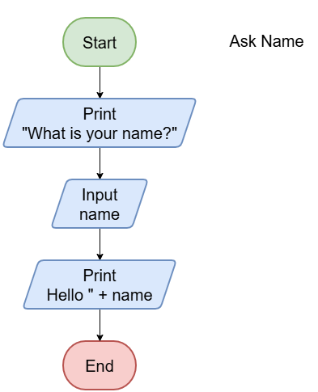

==========================
Flowcharts input
==========================

| Pseudocode can start with BEGIN or START.

.. code-block:: none

    ALGORITHM askName()

    BEGIN
        PRINT "What is your name?"
        INPUT name
        PRINT "Hello, " + name
    END

|
|

.. admonition:: Tasks

    #. What shape is used to start and end the flowchart?
    #. What shape is used for input?
    #. What keyword (in caps) indicates output?
    #. What shape is used for output?
    #. In the pseudocode, what is used to indicate that the PRINT and INPUT statements are part of the sequence of steps between the BEGIN and END?

    .. dropdown::
        :icon: codescan
        :color: primary
        :class-container: sd-dropdown-container

        .. tab-set::

            .. tab-item:: Q1

                What shape is used to start and end the flowchart?

                .. code-block:: none

                    An oval.

            .. tab-item:: Q2

                What shape is used for input?

                .. code-block:: none

                    A parallelogram.

            .. tab-item:: Q3

                What keyword (in caps) indicates output?

                .. code-block:: none

                    PRINT

            .. tab-item:: Q4

                What shape is used for output?

                .. code-block::  none

                    A parallelogram.

            .. tab-item:: Q5

                In the pseudocode, what is used to indicate that the PRINT and INPUT statements are part of the sequence of steps between the BEGIN and END?

                .. code-block::  none

                    They are linked by arrows.