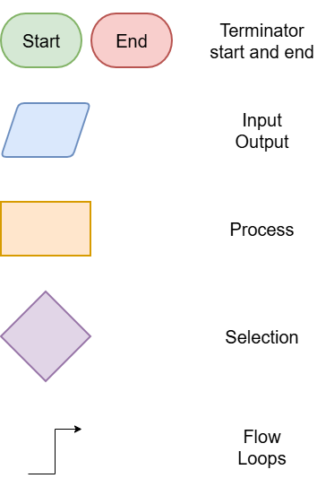

==========================
Flowcharts introduction
==========================

| A flowchart is a visual diagram that illustrates the logical sequence of steps in an algorithm.
| Different shapes and colours are used to represent specific instructions or decisions.

The basic components of a flowchart are:

- **Start and End points** for marking the start and end of the algorithm
- **Data input** for user input
- **Output of results** for output
- **Processes** for assignments, calculations
- **Selection diamonds** for a decision that determine the next path in the workflow
- **Lines with Arrows** for indicating the order in which steps are carried out, especially for loops.

