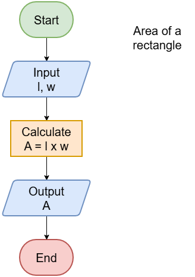

=================================================
Flowcharts process1 Area of a rectangle
=================================================

| Process - Area of a rectangle

.. code-block:: none

    ALGORITHM rectangleArea()

    BEGIN
        INPUT l, w
        A  ←  l * w
        PRINT A
    END

| The new shape in the flowchart (Compute A = l x w), is for a process, such as calculating the value of a variable using a formula and storing it for later use.
| When calculating the area, the value is put in the variable, A. This is known as assignment. A value is assigned to the variable, A.
``A  ←  l * w`` can be read out as "A gets l times w"

    :scale: 100 %
    :align: center

|
|

.. admonition:: Tasks

    #. What shape is used to calculate the area using length and width?
    #. In the pseudocode above, what symbol is used for multiplication?
    #. In the pseudocode above, what symbol is used for assignment?
    #. From the flowchart, what common maths symbol does this assignment symbol replace?

    .. dropdown::
        :icon: codescan
        :color: primary
        :class-container: sd-dropdown-container

        .. tab-set::

            .. tab-item:: Q1

                What shape is used to calculate the area using length and width?

                .. code-block:: none
                    A rectangle.

            .. tab-item:: Q2

                In the pseudocode above, what symbol is used for multiplication?

                .. code-block:: none
                    ``*``

            .. tab-item:: Q3

                 In the pseudocode above, what symbol is used for assignment?

                .. code-block:: none
                    ``←``

            .. tab-item:: Q4

                From the flowchart, what common maths symbol does this assignment symbol replace?

                .. code-block:: none
                    ``=``

