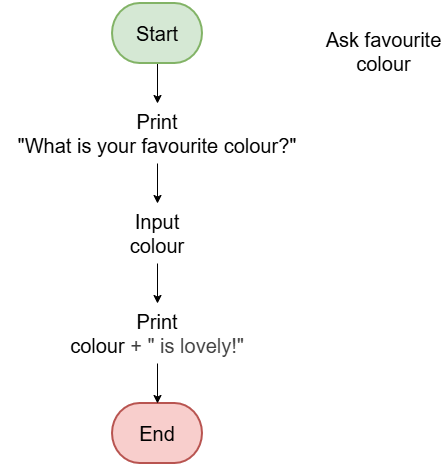

==========================
Flowcharts process3
==========================

| Indenting means adding tabs at the beginning of lines to visually group related statements.
| Indent after control statements like IF, ELSE, ELSEIF, WHILE, FOR.
| Unindent after closing blocks like ENDIF, ENDWHILE, ENDFOR.

| The pseudocode below has errors. See the questions for the corrections.

.. code-block:: none

    ALGORITHM favouriteColour()

    START
    PRINT "What is your favorite colour?"
    INPUT colour
    PRINT colour + " is lovely!"
    END

|
|

.. admonition:: Tasks

    #. In the incorrect pseudocode above, what keypress is missing before each PRINT and INPUT statements? Mark it in before each of the 3 lines.
    #. On the flowchart, draw the correct shape for input statement (INPUT) and the correct shape for the output statements (PRINT).

    .. dropdown::
        :icon: codescan
        :color: primary
        :class-container: sd-dropdown-container

        .. tab-set::

            .. tab-item:: Q1

                In the incorrect pseudocode above, what keypress is missing before each PRINT and INPUT statements? Mark it in before each of the 3 lines.

                The TAB character is used to indent the code.

                .. code-block:: none

                    START
                        PRINT "What is your favorite colour?"
                        INPUT colour
                        PRINT colour + " is lovely!"
                    END

            .. tab-item:: Q2

                On the flowchart, draw the correct shape for input statement (INPUT) and the correct shape for the output statements (PRINT).

                .. image:: drawio_files/input_output/ask_favourite_colour.png
                    :scale: 100 %
                    :align: center

