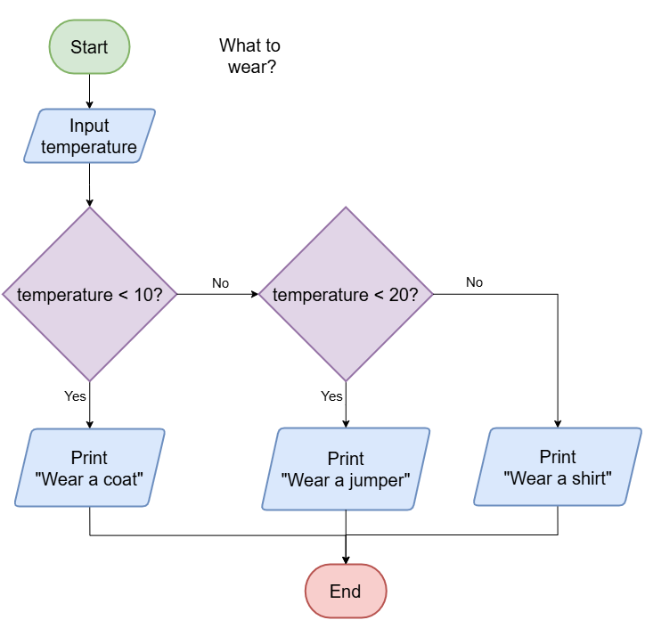

=================================================
Flowcharts What to Wear
=================================================

| ELSEIF (or ELSE IF) is used in pseudocode to handle multiple conditions in a decision-making structure.
| It allows you to check additional conditions if the first IF condition is false — without ending the decision block.
| The pseudocode below shows an algorithm, with 2 decision steps, that suggests what to wear based on the temperature input by the user.

.. code-block:: pseudocode

    ALGORITHM whatToWear()

    BEGIN
        INPUT temperature
        IF temperature < 10 THEN
            PRINT "Wear a coat."
        ELSEIF temperature < 20 THEN
            PRINT "Wear a jumper."
        ELSE
            PRINT "Wear a shirt."
        ENDIF
    END

|
|

.. admonition:: Tasks

    #. In the pseudocode above, there are two lines that end with THEN. What keywords do those lines start with?
    #. What do you wear if the first condition is False and the second is True?
    #. What do you wear if all conditions are False?

    .. dropdown::
        :icon: codescan
        :color: primary
        :class-container: sd-dropdown-container

        .. tab-set::

            .. tab-item:: Q1

                In the pseudocode above, there are two lines that end with THEN. What keywords do those lines start with?

                .. code-block:: pseudocode

                    IF and ELSEIF

            .. tab-item:: Q2

                What do you wear if the first condition is False and the second is True?

                .. code-block:: pseudocode

                    A jumper.

            .. tab-item:: Q3

                What do you wear if all conditions are False?

                .. code-block:: pseudocode

                    A shirt.

