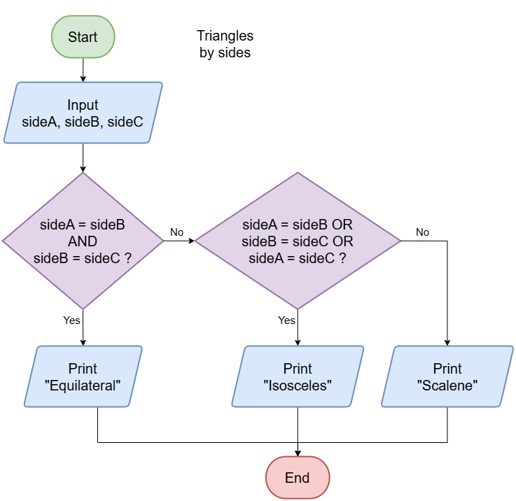

=================================================
Flowcharts Classify Triangles by Sides
=================================================

| Logical operators are used to combine conditions in decision-making.

.. list-table:: Logical Operators
   :header-rows: 1
   :widths: 15 20 65

   * - Operator
     - Name
     - Description
   * - AND
     - Logical AND
     - True only if both conditions are true
   * - OR
     - Logical OR
     - True if at least one condition is true
   * - NOT
     - Logical NOT
     - Reverses the truth value (true → false)

----

| The flowchart below checks to see if a triangle has all sides equal, or just 2 sides equal, and classifies it accordingly.

| The pseudocode below checks to see if a triangles has all sides equal, or just 2 sides equal, or none equal, and classifies it accordingly.

.. code-block:: pseudocode

    ALGORITHM triangleType()

    BEGIN
        INPUT sideA, sideB, sideC
        IF sideA = sideB AND sideB = sideC THEN
            PRINT "Equilateral triangle."
        ELSEIF sideA = sideB OR sideB = sideC OR sideA = sideC THEN
            PRINT "Isosceles triangle."
        ELSE
            PRINT "Scalene triangle."
        ENDIF
    END

|

.. admonition:: Tasks

    #. In the pseudocode, in the IF statement above, which logical operator is used to see if all 3 sides are of equal length?
    #. In the pseudocode, in the ELSEIF statement above, what is the most number of sides that can be equal?

    .. dropdown::
        :icon: codescan
        :color: primary
        :class-container: sd-dropdown-container

        .. tab-set::

            .. tab-item:: Q1

                In the pseudocode, in the IF statement above, which logical operator is used to see if all 3 sides are of equal length?

                '' code-block:: none

                    AND

            .. tab-item:: Q2

                In the pseudocode, in the ELSEIF statement above, what is the most number of sides that can be equal?

                '' code-block:: none

                    2 sides, since 3 sides has been covered in the IF statement and decided to be false.

