=======================
Random walks
=======================

| VC2M5N10: level 5: Follow a mathematical algorithm involving branching and repetition (iteration); create and use algorithms involving a sequence of steps and decisions and digital tools to experiment with factors, multiples and divisibility; identify, interpret and describe emerging patterns

* simulating a simple random walk

----

1D walk plot: Walking the plank
---------------------------------

| Simulate walking the plank on a pirate ship.
| Have 9 positions on the plank, from 1 to 9, with position 1 at the start of the plank and 9 at the end.
| Start at position 3.

| The pseudocode to simulate a 1D random walk and plot the results.

.. code-block:: pseudocode

    SET current_directory = directory_of_this_file

    FUNCTION random_walk_1d(start_position = 3):
        SET x = start_position
        CREATE list positions = [x]

        WHILE x > 0 AND x < 10:
            CHOOSE step randomly from [-1, +1]
            IF step == +1:
                x = x + 1
            ELSE:
                x = x - 1
            ADD x to positions

        RETURN positions

    FUNCTION plot_random_walk_1d(positions):
        DRAW line graph of positions
        SET title = "Random Walk 1D"
        LABEL x-axis = "Step"
        LABEL y-axis = "Position"
        CALL save_plot(graph, "random_walk_1D.png")
        DISPLAY graph

    FUNCTION save_plot(graph, filename):
        SET filepath = current_directory + filename
        SAVE graph to filepath with high resolution

    BEGIN:
        positions = CALL random_walk_1d(start_position = 3)
        CALL plot_random_walk_1d(positions)

------------------------

| The python to simulate a 1D random walk and plot the results.

.. literalinclude:: files/random_walk_1D_plot.py
    :linenos:

| Examples 1D walks are below:

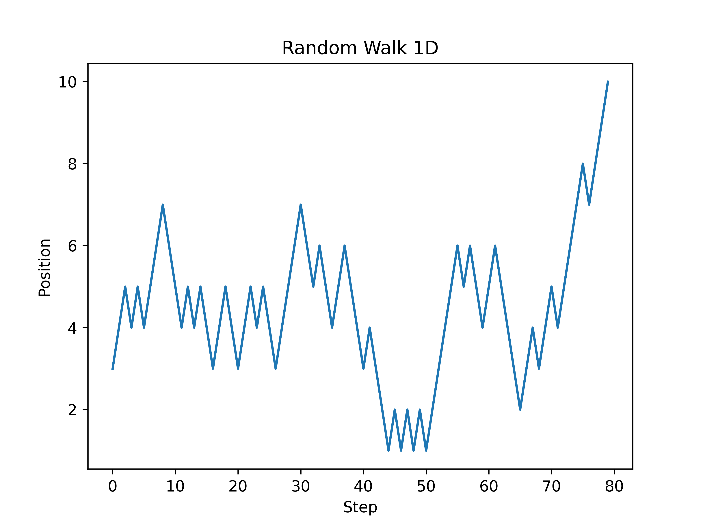

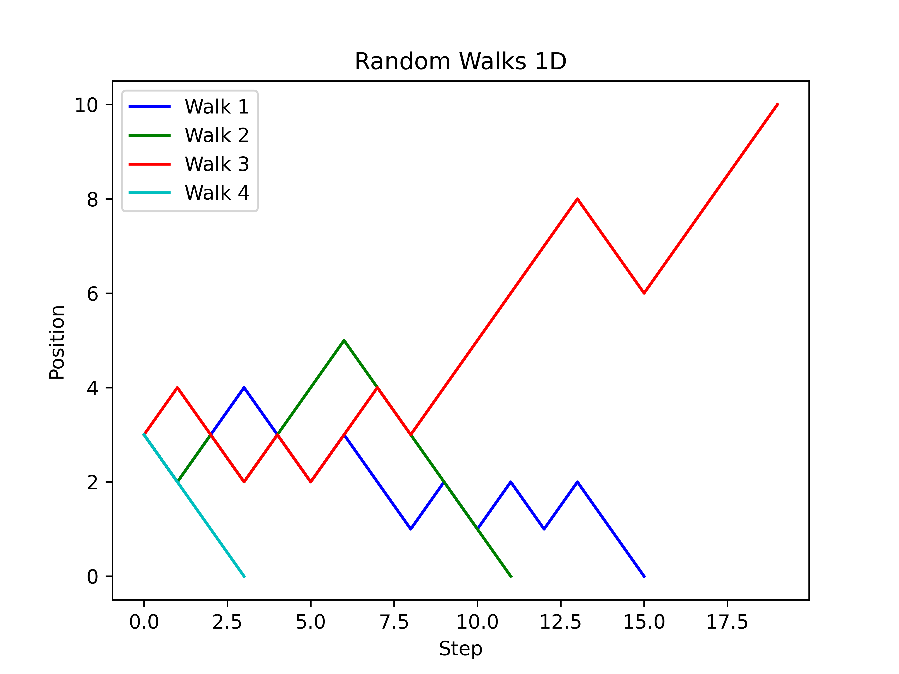

----

Walking the plank analysis
---------------------------

| Simulate walking the plank on a pirate ship.
| Have 9 positions on the plank, from 1 to 9, with position 1 at the start of the plank and 9 at the end.

.. literalinclude:: files/random_walk_1D.py
    :linenos:

| The code below simulates a 1D random walk.
| The `random_walk_1d` function takes a starting position as an argument, with a default value of 3.
| The function simulates a random walk by generating random steps using the `random.randint` function.
| If the step is 1, the position is incremented by 1, otherwise it is decremented by 1.
| The new position is then appended to the `x_positions` list.
| This continues until the position reaches either 0 or 10.

| The script then simulates `number_of_walks` walks for each starting position from 1 to 9.
| For each walk, it checks if the final position is 0 and if so, increments the `safe_count` variable.
| Finally, it prints the starting position and the percentage of walks that ended at position 0.

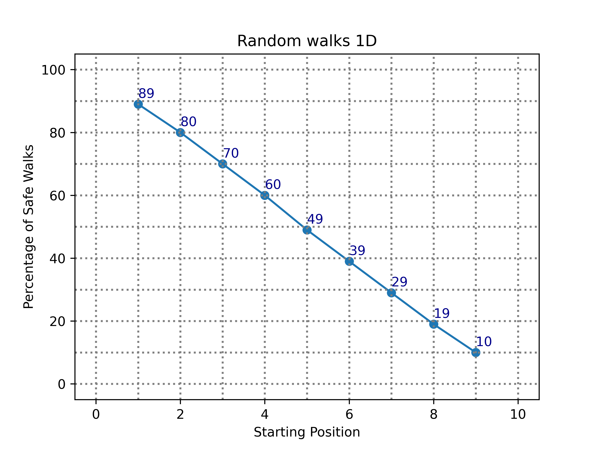

----

2D walk plot
------------------------

| The code below simulates a 2D random walk.

.. literalinclude:: files/random_walk_2D_plot.py
    :linenos:

| Examples 2D walks are below:

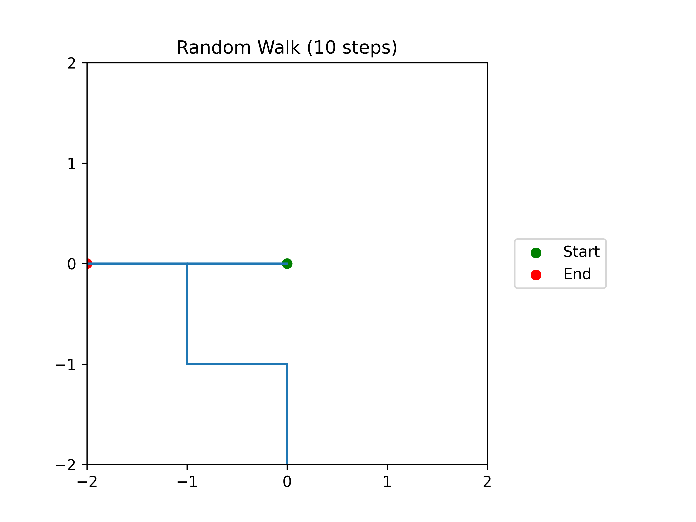

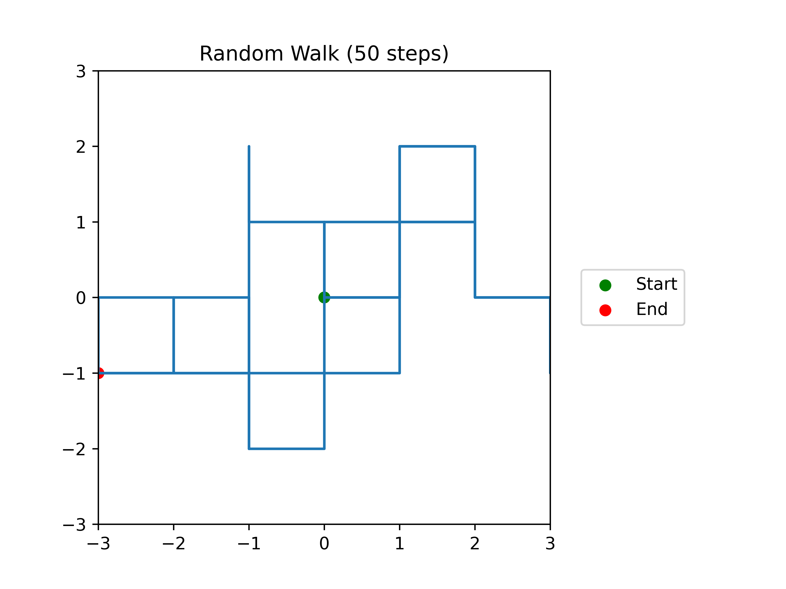

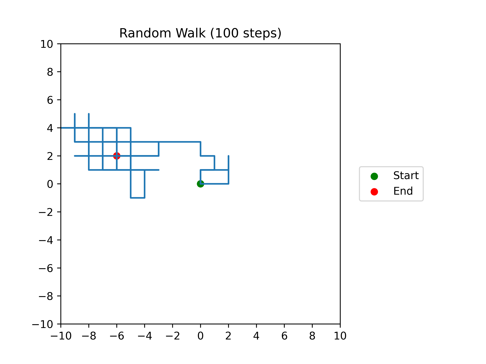

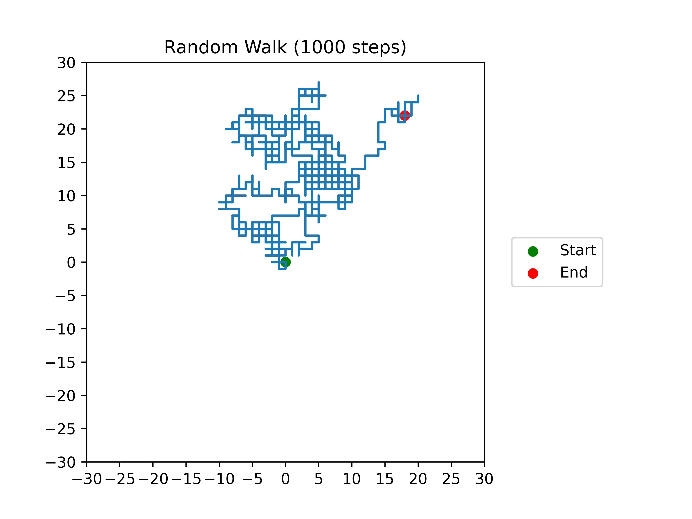

----

| The code below simulates a multiple 2D random walks suitable for 2 to 6 walks.

.. literalinclude:: files/random_walk_2D_multiplot.py
    :linenos:

| Examples multi 2D walks are below:

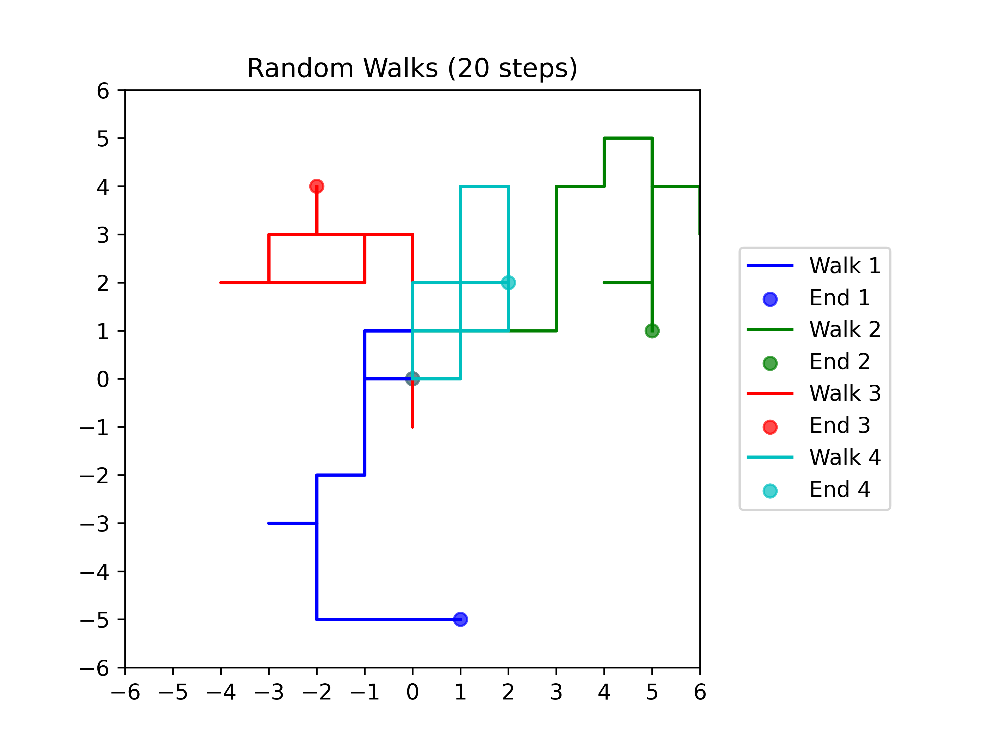

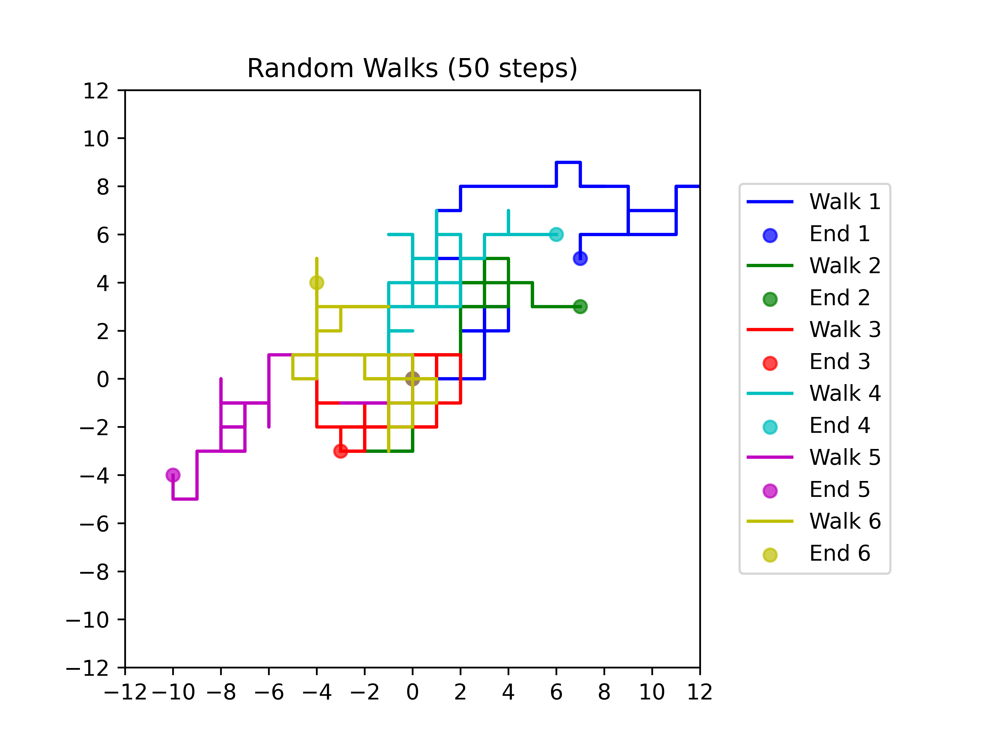

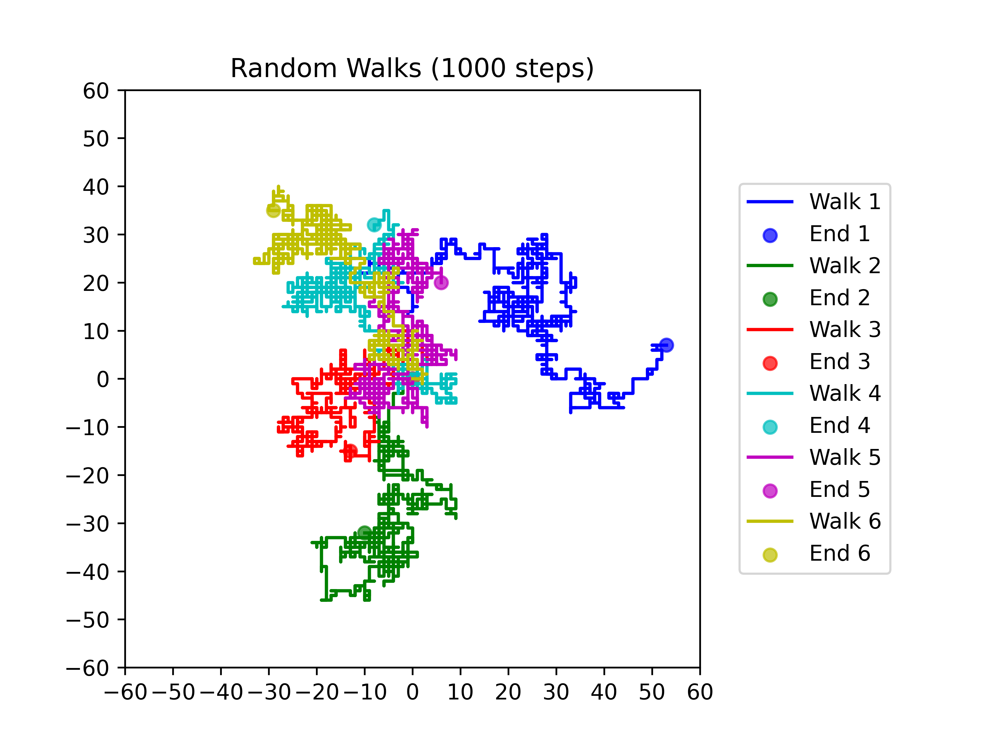

----

2D walks analysis
------------------------

| The code below simulates a 2D random walk.

.. literalinclude:: files/random_walks_2D.py
    :linenos:

| The `random_walk` function takes an argument `n` which represents the number of steps in the walk.
| The function initializes the starting position at `(0, 0)` and then simulates the walk by generating random steps using the `random.choice` function.
| The step is chosen from a list of possible steps: up, down, left, or right.
| The new position is calculated by adding the step to the current position.

| The script then simulates `number_of_walks` walks for each walk length from 0 to 30.
| For each walk, it checks if the final position is within (`dist_to_home`) 4 blocks of the origin (using the Manhattan distance) and if it is, increments the `close_to_home` variable.
| Finally, for plotting, it returns the walk length and the percentage of walks that ended within 4 blocks of the origin.

| The Manhattan distance, also known as the taxicab distance or city block distance, is a way to measure the distance between two points in a grid-like space.
| It is calculated as the sum of the absolute differences between the coordinates of the two points.
| For example, if there are two points `P1` and `P2` with coordinates `(x1, y1)` and `(x2, y2)`, respectively, then the Manhattan distance between them is `abs(x1 - x2)` + `abs(y1 - y2)`.
| This distance can be imagined as the length needed to move between two points in a grid where you can only move up, down, left or right.

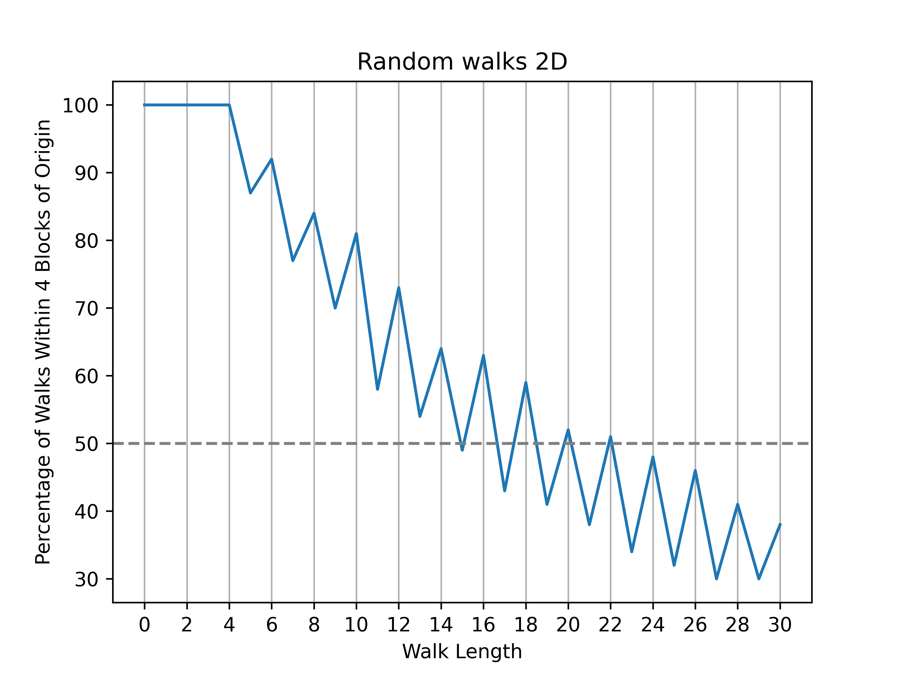

----

Levy flights
--------------------

| Levy flights are random walks with longer jumps.
| They can simulate animals looking for food.
| The code below creates some longer jumps.

| The pseudocode to simulate a 2D random walk with Levy flights and plot the results.

.. code-block:: pseudocode

    SET current_directory = directory_of_this_file

    FUNCTION levy_flight(total_steps, levy_interval, min_jump, max_jump):
        SET x = 0, y = 0
        CREATE list coords = [(0, 0)]

        FOR i from 0 to total_steps - 1:
            IF i is divisible by levy_interval:
                r = random integer between min_jump and max_jump
                theta = random angle between 0 and 2π
                dx = integer part of (r * cos(theta))
                dy = integer part of (r * sin(theta))
            ELSE:
                (dx, dy) = random choice from [(0,1), (0,-1), (1,0), (-1,0)]

            x = x + dx
            y = y + dy
            ADD (x, y) to coords

        RETURN coords

    FUNCTION plot_walk(coords, levy_interval):
        EXTRACT x_coords and y_coords from coords
        DRAW line graph of (x_coords, y_coords)
        MARK starting point in green
        MARK ending point in red

        SET max_coord = maximum absolute value among all coordinates

        IF max_coord > 100:
            ticks = multiples of 50 up to max_coord
        ELSE IF max_coord > 60:
            ticks = multiples of 20 up to max_coord
        ELSE IF max_coord > 30:
            ticks = multiples of 10 up to max_coord
        ELSE IF max_coord > 16:
            ticks = multiples of 5 up to max_coord
        ELSE IF max_coord > 8:
            ticks = multiples of 2 up to max_coord
        ELSE:
            ticks = integers from -max_coord to +max_coord

        SET x-axis ticks = ticks
        SET y-axis ticks = ticks
        LIMIT x-axis and y-axis to [-max_coord, +max_coord]
        ADD legend for Start and End
        SET title = "Random Walk (total_steps steps)"
        ADJUST layout for legend
        CALL save_plot(graph, "random_walk_Levy_every_[levy_interval]_of_[total_steps]")
        DISPLAY graph

    FUNCTION save_plot(graph, filename):
        filepath = current_directory + filename
        SAVE graph to filepath with high resolution

    BEGIN:
        levy_interval = 100
        total_steps = 1000
        min_jump = 10
        max_jump = 20

        coords = CALL levy_flight(total_steps, levy_interval, min_jump, max_jump)
        CALL plot_walk(coords, levy_interval)

| The python to simulate a 2D random walk with Levy flights and plot the results.

.. literalinclude:: files/random_walk_2D_plot_Levy.py
    :linenos:

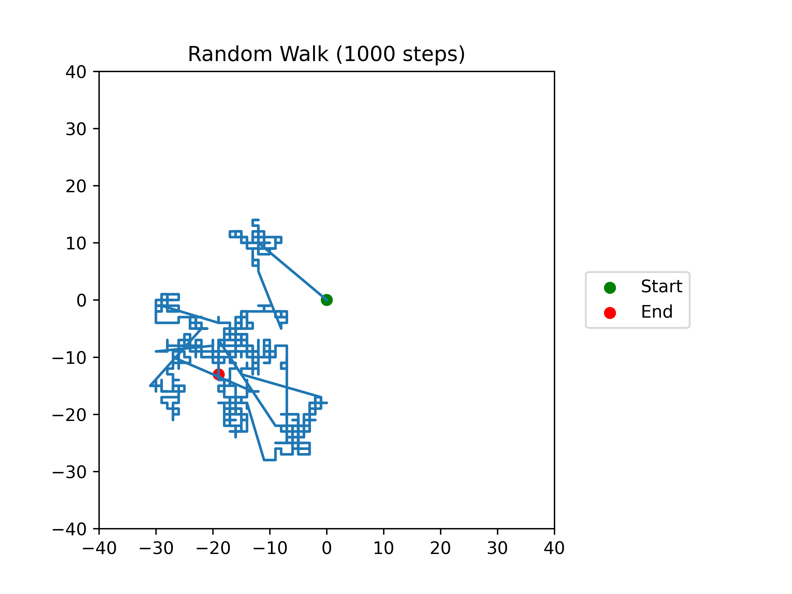

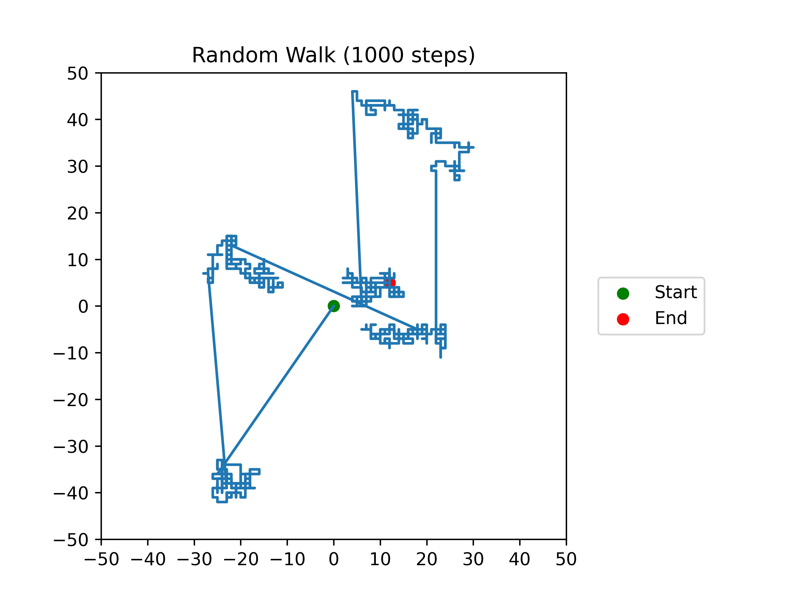

